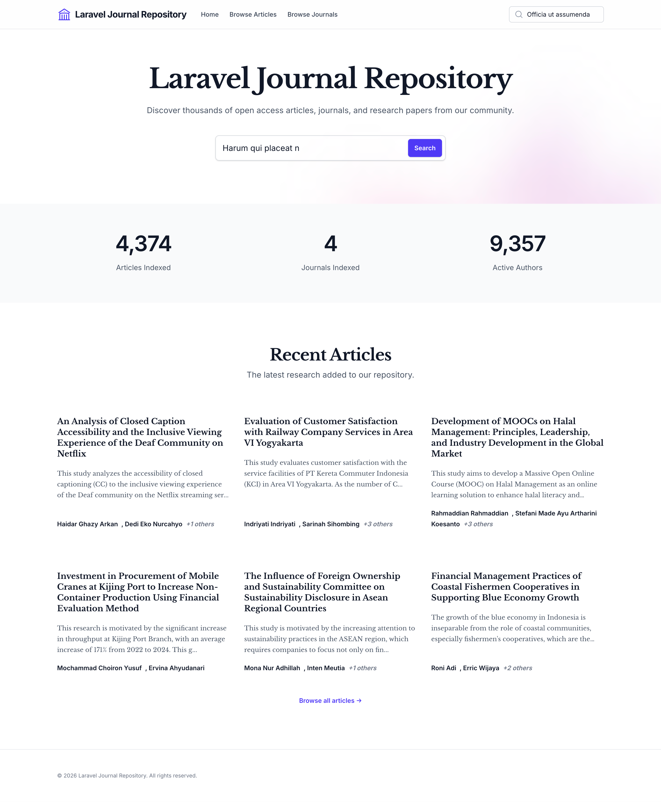

# Laravel Journal Repository

A Laravel application designed to harvest, manage, and display academic articles from Open Journal Systems (OJS) via OAI-PMH. This application provides a robust backend for harvesting metadata, a Filament-powered admin panel for management, and a public-facing frontend for browsing journals and articles.

## Features

- **OAI-PMH Harvesting**: Automated and manual harvesting of article metadata (titles, authors, abstracts, PDFs, etc.) from OJS endpoints.
- **Filament Admin Panel**: A sleek, modern dashboard to manage Journals, Articles, Authors, and view Harvest Logs.
- **Public Frontend**: browsable interface for users to explore journals and read articles.
- **Automated Scheduling**: Configured background jobs to keep local data in sync with remote OJS servers.
- **Search & Filtering**: Efficient searching enabling users to find specific content easily.

## Screenshots



## Installation

Follow these steps to set up the project locally:

1.  **Clone the Repository**

    ```bash
    git clone <repository-url>
    cd ojsrepo
    ```

2.  **Install Dependencies**

    ```bash
    composer install
    npm install
    ```

3.  **Environment Configuration**
    Copy the example environment file and configure your database credentials.

    ```bash
    cp .env.example .env
    ```

    Update `.env` with your DB details:

    ```ini
    DB_CONNECTION=mysql
    DB_HOST=127.0.0.1
    DB_PORT=3306
    DB_DATABASE=ojsrepo
    DB_USERNAME=root
    DB_PASSWORD=
    ```

4.  **Generate Application Key**

    ```bash
    php artisan key:generate
    ```

5.  **Run Migrations**
    Set up the database tables.

    ```bash
    php artisan migrate
    ```

6.  **Link Storage**
    Ensure efficient file serving.

    ```bash
    php artisan storage:link
    ```

7.  **Build Assets**

    ```bash
    npm run build
    ```

8.  **Start the Server**
    ```bash
    php artisan serve
    ```
    Or if using Sail:
    ```bash
    ./vendor/bin/sail up -d
    ```

## Usage

### Admin Panel

Access the management dashboard at `/admin`.

- **Create an Admin User**:
    ```bash
    php artisan make:filament-user
    ```
    Follow the prompts to create your login credentials.

### OAI-PMH Harvesting

The core feature of this application is harvesting data from OJS.

#### 1. Automated Harvesting (Scheduler)

The application is configured to harvest enabled journals every 5 minutes.
Ensure the Laravel scheduler is running in your environment:

```bash
php artisan schedule:work
```

_In production, this should be set up as a cron job._

#### 2. Manual Harvesting (Console Command)

You can manually trigger a harvest for all enabled journals or a specific one using the Artisan command.

**Harvest All Enabled Journals:**

```bash
php artisan app:harvest-journals
```

**Harvest a Specific Journal:**
Use the `--journal` option with the Journal ID.

```bash
php artisan app:harvest-journals --journal=1
```

### Public Frontend

Visit the homepage `/` to browse the collection of harvested journals and articles.

## Contributing

1.  Fork the repository.
2.  Create a feature branch (`git checkout -b feature/amazing-feature`).
3.  Commit your changes (`git commit -m 'Add some amazing feature'`).
4.  Push to the branch (`git push origin feature/amazing-feature`).
5.  Open a Pull Request.

## License

The Laravel framework is open-sourced software licensed under the [MIT license](https://opensource.org/licenses/MIT).
